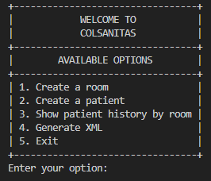
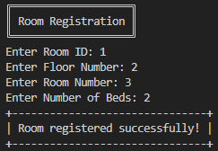
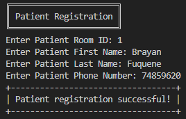
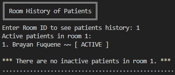
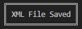
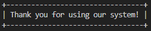
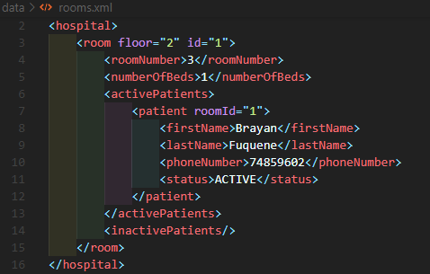
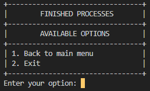
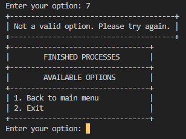
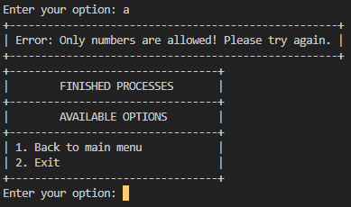

# Colsanitas Hospital App

Welcome to Colsanitas Hospital App! This is a Java project focused on the development of a hospital management system. The project is developed by the students of the Computer and Systems Engineering program at the Universidad Pedágica y Tecnológica de Colombia. In this app we manage XML Files.

## Folder Structure

The workspace contains the following folders:

- `lib` : The folder to maintain dependencies.
- `bin` : the folder to maintain compiled classes.
- `data` : The folder to maintain data files.
- `src` : The folder to maintain sources.

Inside the `src` folder, you will find the following packages:

- `model` : This package contains necessary classes for the proyect.
- `view` : This package contains classes that are used to show menus and inputs that users will need to register data.
- `presenter` : This package contains the runnable class and a Constants class, that class contains most of the messages that are used in the project.

## How to run the project

To run app, follow the steps below.

1. Open src folder.
2. Open presenter package.
3. Open Presenter.java and run it.

## How to use the app

The first thing you will see is the main menu.

If you want to create a new Room, you will need to select the `option 1`. Then, the app will ask you for some information about the room. Once you have entered all the information, you will see a message that says that the room was created successfully.

If you want to create a new Patient, you will need to select the `option 2`. Then, the app will ask you for some information about the patient. Once you have entered all the information, you will see a message that says that the patient was created successfully.

If you want to see the patients history of a room, you will need to select the `option 3`. Then, the app will ask you for the room id. Once you have entered the room id, you will see the patients history of that room.

If you want to save all the information in a XML file, all you have to do is select the `option 4`. Once you have selected that option, you will see a message that says that the information was saved successfully.

If you want to exit the app, all you have to do is select the `option 5`. Once you have selected that option, the info will be saved in the XML FILE, no message saying that will appear but you will see a goodbye message.

## HEY! Where is the XML file?

If you want to see the XML file, you will need to open the `data` folder and open the file called `rooms.xml`.

You will see the information you registered in the app. For our little example, it will look like this:

## Keep in mind that...

After any of the available processes, the app will ask you if you want to continue. If you want to continue, you will need to select the `option 1` and you will be redirected to `main menu`. If you don't want to continue, you will need to select the `option 2` and the app will be closed.

## Hey! Be careful!

If you enter a invalid option, the app will ask you to enter a valid option and the respective menu will be shown again. For example, if we enter the number `7` in the menu above, this is what will happen:

In the same way, if you enter a letter instead of a number, the app will ask you to enter a valid option and the respective menu will be shown again. For example, if we enter the letter `a` in the menu above, this is what will happen:

Hey! Please **remember:**

**That validations are applied to all the menus in the app.**

**The input validations are applied to all the numeric inputs in the app.**

A lot of **validations** are applied to the app, for example, if you try to **create a room with an id that already exists**, or if you try to **create a room which number already exists in the same floor**, or if you try to **register a pattient in a room that doesn't exist**, and so on. Tons of validations are applied but don't worry, **the app will tell you what is wrong and you will be able to fix it**. Just read the **messages** and you will be fine. In each of the validations, the app will ask you to **enter the information again**.

## Authors

Jaider Leonardo Castellanos Peña
- Email: jaider.castellanos@uptc.edu.co
  

Brayan Daniel Fuquene Sandoval
- Email: brayan.fuquene01@uptc.edu.co

